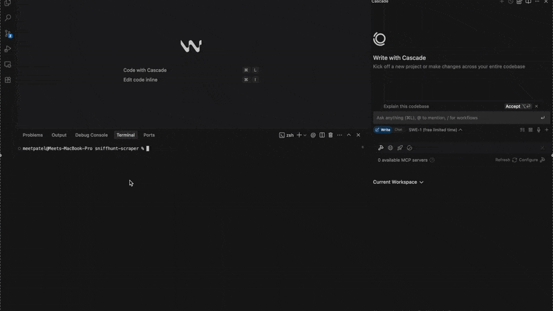

<div align="center">

# 🚀 SniffHunt Scraper


## **The Best-in-Class URL-to-LLM-Ready Markdown Engine** ✨🧠🔍

🔍 Transform any web interface SPAs, dynamic dashboards, or complex content layers into semantically structured, LLM-optimized Markdown with human-level intelligence. **Outperforms FireCrawl, Jina Reader, and other paid solutions while running entirely on your local machine.**

### 🏆 Superior to Paid Alternatives
| Feature | SniffHunt | FireCrawl (/extract) | Jina Reader | Others |
|---------|-----------|-----------|-------------|---------|
| **Cost** | 🆓 Free & Open Source | 💰 $99-799/month | 💰 usage-based | 💰 $50-1000/month |
| **Privacy** | 🔒 100% Local | ☁️ Cloud-based | ☁️ Cloud-based | ☁️ Cloud-based |
| **AI Intelligence** | 🧠 Cognitive DOM modeling | ⚡ Basic extraction | 📄 Text-only | 📄 Limited |
| **Interactive Content** | ✅ Full UI interaction | ❌ Static only | ❌ Static only | ❌ Limited |
| **LLM Optimization** | 🎯 Purpose-built | 📝 Generic output | 📝 Generic output | 📝 Basic |

[](https://github.com/mpmeetpatel/sniffhunt-scraper)
[](https://nodejs.org/)

</div>

> ⚠️ **Market Reality**: While FireCrawl and Jina Reader charge premium prices for basic text extraction, SniffHunt delivers enterprise-grade AI intelligence completely free. Join thousands of developers who've eliminated expensive SaaS subscriptions. 💡🔁💬

## 🔥 Why SniffHunt Outperforms Paid Solutions

**The Problem with Current Tools**: FireCrawl, Jina Reader, and similar services charge hundreds per month for basic HTML-to-text conversion that breaks on modern web applications. They process your sensitive data on external servers while delivering inferior results.

**The SniffHunt Advantage**: Purpose-built for the LLM era with cognitive intelligence that understands web interfaces like a human developer. Zero recurring costs, complete privacy, superior extraction quality.

### 🎯 Competitive Advantages Over Paid Tools

* 🧠 **Advanced AI Intelligence**: While FireCrawl uses basic text extraction, SniffHunt employs cognitive modeling to understand context and semantics
* ⚛️ **Interactive Content Mastery**: Handles complex SPAs and dynamic interfaces that cause other tools to fail completely  
* 🕹️ **True UI Understanding**: Navigates tabs, modals, and dropdowns like a human user, not just scraping static HTML
* 💬 **LLM-Optimized Output**: Generates markdown specifically formatted for optimal LLM consumption and context understanding
* 📦 **Enterprise Privacy**: Runs entirely in your local environment, unlike cloud-based tools that process your data externally
* 🔐 **Zero Vendor Lock-in**: Open source with complete control, vs. proprietary APIs that can change pricing anytime


## ⚙️ Quick Start Guide (≈1 Minute Setup)

### Installation & Launch

#### Step 1:
```bash
git clone https://github.com/mpmeetpatel/sniffhunt-scraper.git
cd sniffhunt-scraper
```

#### Step 2:
```bash
pnpm install # or npm install
cp .env.example .env # Add your Gemini API key (OR You can add multiple Gemini API Keys as well)
```

### Step 3:
```bash
pnpm start # or npm start
```



**Expected Output (Output will slightly differ based on your system):**
- Check your output and use that MCP configuration in your MCP-compatible client
- You can check demo video for more details

```
✅ Context Scraper API server running on http://0.0.0.0:6000 or http://localhost:6000

Example curl usage: 

curl -X POST http://localhost:6000/scrape -H "Content-Type: application/json" -d '{"url": "https://example.com", "mode": "normal"}'
curl -X POST http://localhost:6000/scrape -H "Content-Type: application/json" -d '{"url": "https://anu-vue.netlify.app/guide/components/alert.html", "mode": "beast", "query": "Outlined Alert Code snippets"}'
----------------------------------------------------

🔧 MCP Configuration (Copy & Paste):
{
  "mcpServers": {
    "sniffhunt-scraper": {
      "command": "node",
      "args": [
        "/Users/meetpatel/Developer/Release/sniffhunt-scraper/mcp/src/index.js"
      ]
    }
  }
}
----------------------------------------------------

Try Some Examples:

scrape https://example.com using beast mode
Parse https://example.com in normal mode
Extract https://anu-vue.netlify.app/guide/components/alert.html in beast mode & grab the "Outlined Alert Code snippets"
```

## 🔧 Model Context Protocol Integration

SniffHunt functions as a **contextual knowledge acquisition node** for LLMs through the Model Context Protocol. This integration transforms SniffHunt from a simple scraping tool into an intelligent content ingestion agent.

### MCP Configuration

Add to your MCP-compatible client configuration:

```json
{
  "mcpServers": {
    "sniffhunt-scraper": {
      "command": "node",
      "args": [
        "/absolute/path/to/sniffhunt-scraper/mcp/src/index.js"
      ]
    }
  }
}
```

> **Path Configuration**: Replace `/absolute/path/to/sniffhunt-scraper/` with your actual installation directory

### Natural Language Commands

Your AI agent can now process commands like:
* `scrape https://docs.python.org/3/tutorial/ using beast mode`
* `Extract component examples from https://mui.com/material-ui/ in normal mode`
* `Parse https://reactjs.org/docs/ and grab "hooks documentation"`

## 🧠 Intelligent Extraction Modes

### ⚡ Normal Mode — Static & Lightly Dynamic Content

Optimized for standard web pages and simple SPAs:

* ✅ **Single-Page Applications** (React, Vue, Angular)
* ✅ **Lazy-Loaded Content** with intelligent wait strategies
* ✅ **Semantic Markdown Conversion** from complex DOM structures
* ✅ **Fast Processing** for high-volume extraction tasks

**Best For**: Documentation sites, blogs, news articles, product pages

### 🦁 Beast Mode — Complex Interactive Interfaces

Advanced interaction modeling for sophisticated web applications:

* ✅ **UI Component Interaction** (tabs, accordions, modals, dropdowns)
* ✅ **AJAX Content Resolution** with dynamic loading detection
* ✅ **Dashboard Navigation** through complex interface states
* ✅ **Context-Aware Extraction** based on semantic understanding

**Best For**: Admin dashboards, analytics tools, component libraries, configurators

## 🧪 Production-Ready Examples

### Developer Documentation Extraction
```bash
# Extract specific sections from Python documentation
curl -X POST http://localhost:6000/scrape \
  -H "Content-Type: application/json" \
  -d '{
    "url": "https://docs.python.org/3/tutorial/",
    "mode": "normal",
    "query": "give me code snippets from functions and classes tutorial"
  }'
```

### E-Commerce Product Information
```bash
# Extract specifications from product pages with tabs
curl -X POST http://localhost:6000/scrape \
  -H "Content-Type: application/json" \
  -d '{
    "url": "https://www.apple.com/macbook-pro",
    "mode": "beast",
    "query": "give me technical specifications and pricing details"
  }'
```

### Component Library Documentation
```bash
# Extract code examples from MUI documentation
curl -X POST http://localhost:6000/scrape \
  -H "Content-Type: application/json" \
  -d '{
    "url": "https://mui.com/material-ui/react-button/",
    "mode": "beast",
    "query": "give me button variants with TypeScript examples"
  }'
```

## 📡 API Reference

### `POST /scrape` - Content Extraction Endpoint

**Request Body:**
```json
{
  "url": "https://example.com", // (required)
  "mode": "normal" | "beast", // Default: normal, use beast for complex interfaces
  "query": "natural language content description" // (optional but good to have)
}
```

**Parameters:**
- `url` (required): Target URL for content extraction
- `mode` (optional): Extraction strategy (`normal` for standard content, `beast` for interactive interfaces)
- `query` (optional): Natural language description of desired content for semantic filtering

**Response Format:**
```json
{
  "success": true,
  "content": "# Extracted Content\n\nMarkdown-formatted content here...",
  "metadata": {
    "title": "Page Title",
    "url": "https://example.com",
    "mode": "beast"
  }
}
```

### `GET /health` - Service Status

Returns API health status and configuration validation.

## 🛠️ Troubleshooting & Diagnostics

### Browser Engine Issues
If you encounter browser runtime failures:

```bash
# Install Playwright dependencies 
# (if not already installed or have issues)
npx -y playwright-core install --with-deps --only-shell chromium
```

### Extraction Quality Issues

**Problem**: Incomplete or inaccurate content extraction
**Solutions**:
1. Verify Gemini API key configuration and quota limits
2. Monitor server logs for timeout or authentication failures
3. Switch from `normal` to `beast` mode for complex interfaces
4. Refine natural language query for better semantic targeting

**Problem**: Slow extraction performance
**Solutions**:
1. Use `normal` mode for static content when possible
2. Implement request caching for frequently accessed URLs
3. Optimize query specificity to reduce processing scope

## 🤝 Contributing to SniffHunt

We welcome contributions from the developer community:

### Development Setup
1. **Fork Repository**: Create your own fork of SniffHunt
2. **Feature Branch**: `git checkout -b feature/your-enhancement`
3. **Development**: Make changes with comprehensive test coverage
4. **Testing**: Ensure all existing tests pass and add new test cases
5. **Pull Request**: Submit with clear description and rationale

### Contribution Guidelines
- Follow existing code style and architectural patterns
- Update documentation for user-facing changes
- Ensure backward compatibility unless breaking changes are necessary
- Soon will add guideline doc

## 🌟 Community & Support

### Getting Help
* 🐞 **Bug Reports**: [GitHub Issues](https://github.com/mpmeetpatel/sniffhunt-scraper/issues)
* 💬 **Discussions**: [GitHub Discussions](https://github.com/mpmeetpatel/sniffhunt-scraper/discussions)
* 📧 **Direct Support**: For enterprise integrations and custom requirements

### Show Your Support
* ⭐ **Star the Repository**: [GitHub](https://github.com/mpmeetpatel/sniffhunt-scraper)
* 🔼 Upvote on producthunt: 
  
  <a href="https://www.producthunt.com/products/sniffhunt?embed=true&utm_source=badge-featured&utm_medium=badge&utm_source=badge-sniffhunt" target="_blank"></a>
* ☕ **Support Development**: [Buy Me Coffee](https://coff.ee/mpmeetpatel)

  


## 📄 License & Legal

- **Personal Use:** Free
- **Commercial Use:** ❌ (contact for licensing)
- **Code redistribution/reselling:** ❌
- **License** - see [LICENSE](./LICENSE) file for details.

**Privacy & Compliance**: SniffHunt is a true privacy-first solution that runs entirely on your infrastructure, ensuring your data never leaves your control.
