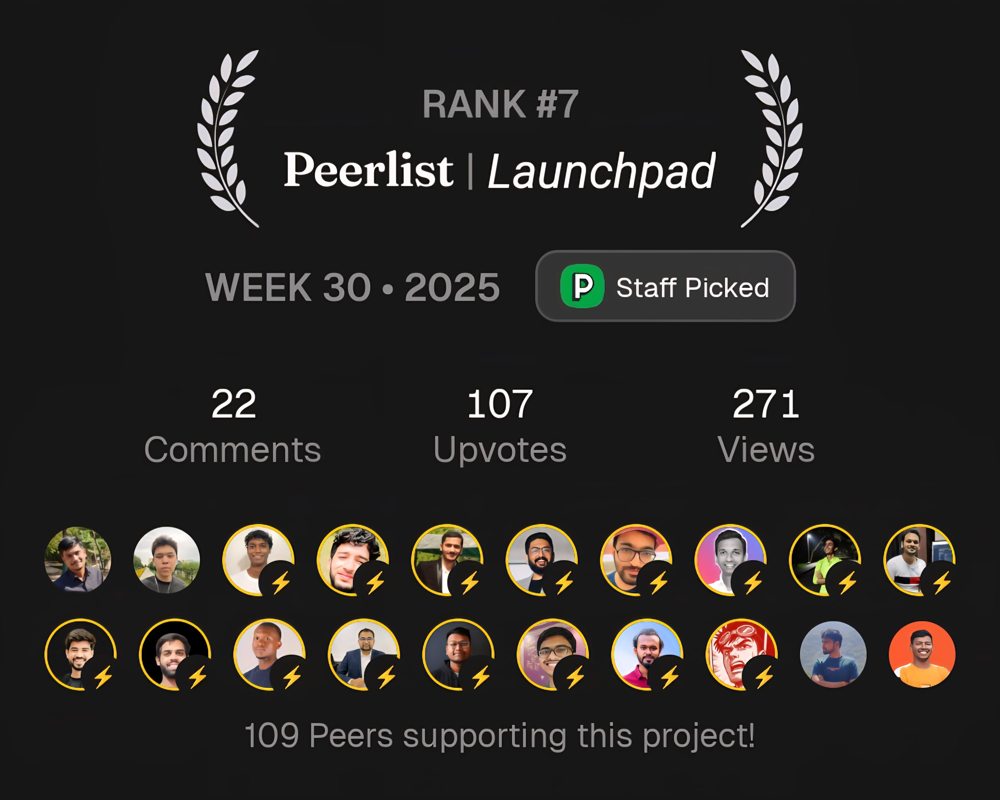

<div align="center">

# 🚀 SniffHunt Scraper


## **The Best-in-Class URL-to-LLM-Ready Markdown Engine** ✨🧠🔍

🔍 Transform any web interface SPAs, dynamic dashboards, or complex content layers into semantically structured, LLM-optimized Markdown with human-level intelligence. **Outperforms FireCrawl, Jina Reader, and other paid solutions while running entirely on your local machine.**

🌟 **Modern Bun-powered workspace with comprehensive scraper, Hono API server, and MCP integration** 🌟

<a href="https://peerlist.io/meetpatel/project/sniffhunt-scraper">
  
</a>

<br />

[](https://github.com/mpmeetpatel/sniffhunt-scraper)
[](https://bun.sh/)

</div>

## Table of Contents

- [Why SniffHunt?](#why-sniffhunt)
- [Key Features](#key-features)
- [Quick Start Guide](#quick-start-guide)
- [Integration Methods](#integration-methods)
  - [MCP Integration](#mcp-integration)
  - [API Server](#api-server)
  - [Web Interface](#web-interface)
  - [CLI Scraper](#cli-scraper)
- [Use Cases](#use-cases)
- [Community & Support](#community--support)

## Why SniffHunt?

### 🏆 Superior to Paid Alternatives

| Feature                 | SniffHunt                 | FireCrawl (/extract) | Jina Reader       | Others            |
| ----------------------- | ------------------------- | -------------------- | ----------------- | ----------------- |
| **Cost**                | 🆓 Free & Open Source     | 💰 $99-799/month     | 💰 usage-based    | 💰 $50-1000/month |
| **Privacy**             | 🔒 100% Local             | ☁️ Cloud-based       | ☁️ Cloud-based    | ☁️ Cloud-based    |
| **AI Intelligence**     | 🧠 Cognitive DOM modeling | ⚡ Basic extraction  | 📄 Text-only      | 📄 Limited        |
| **Interactive Content** | ✅ Full UI interaction    | ❌ Static only       | ❌ Static only    | ❌ Limited        |
| **LLM Optimization**    | 🎯 Purpose-built          | 📝 Generic output    | 📝 Generic output | 📝 Basic          |

## Key Features

### 🧠 Advanced AI Intelligence
While FireCrawl, Jina & Others uses basic text extraction, SniffHunt employs cognitive modeling to understand context and semantics.

### ⚛️ Interactive Content Mastery
Handles complex SPAs and dynamic interfaces that cause other tools to fail completely.

### 🕹️ True UI Understanding
Navigates tabs, modals, and dropdowns like a human user, not just scraping static HTML.

### 💬 LLM-Optimized Output
Generates markdown specifically formatted for optimal LLM consumption and context understanding.

### 📦 Enterprise Privacy
Runs entirely in your local environment, unlike cloud-based tools that process your data externally.

## Quick Start Guide

> **What You'll Learn:** How to install and configure SniffHunt, start the API server and web interface, set up MCP integration for AI tools, and see basic usage examples for each component.

### ⚙️ Prerequisites

Before we begin, make sure you have:

- **Bun** >= 1.2.15 ([Install Bun](https://bun.sh/docs/installation))
- **Google Gemini API Key** ([Get free key from Google AI Studio](https://makersuite.google.com/app/apikey))

> **⚠️ API Key Required:** You'll need a Google Gemini API key for the AI-powered content extraction. The free tier is generous and perfect for getting started.

### 🛠️ Installation & Setup

#### Step 1: Clone the Repository

```bash
git clone https://github.com/mpmeetpatel/sniffhunt-scraper.git
cd sniffhunt-scraper
```

#### Step 2: Install Dependencies

```bash
bun install
```

This installs all dependencies for the entire workspace including all apps.

#### Step 3: Configure Environment

```bash
cp .env.example .env
```

Edit the `.env` file and add your Gemini API key:

```bash
# Required
GOOGLE_GEMINI_KEY=your_actual_api_key_here

# Optional (You can provide multiple keys here to avoid rate limiting & load balancing)
GOOGLE_GEMINI_KEY1=your_alternative_key_1
GOOGLE_GEMINI_KEY2=your_alternative_key_2
GOOGLE_GEMINI_KEY3=your_alternative_key_3

# Optional (defaults shown)
PORT=8080
MAX_RETRY_COUNT=2
RETRY_DELAY=1000
PAGE_TIMEOUT=10000
CORS_ORIGIN=*
```

## Integration Methods

Choose your preferred way to use SniffHunt:

### 🚀 Option 1: API Server + Web Interface

Perfect for interactive use and web application integration.

#### Start the API Server

```bash
bun run dev:server
```

The server will start on `http://localhost:8080`

#### Start the Web Interface (Optional)

```bash
# In a new terminal
bun run dev:web
```

Open `http://localhost:6001` in your browser for the beautiful web interface.

#### Test the Setup

```bash
# Test the API
curl -X POST http://localhost:8080/scrape-sync \
  -H "Content-Type: application/json" \
  -d '{"url": "https://example.com", "mode": "normal"}'
```

### 🤖 Option 2: MCP Integration for AI Tools

Integrate SniffHunt directly with Claude Desktop, Cursor, or other MCP-compatible AI tools.

#### Build and Setup MCP Server

```bash
bun run setup:mcp
```

This builds the MCP server and makes it globally available.

#### Configure Your AI Client

Add this to your MCP client configuration (e.g., Cursor, Windsurf, VSCode, Claude Desktop):

```json
{
  "mcpServers": {
    "sniffhunt-scraper": {
      "command": "npx",
      "args": ["-y", "sniffhunt-scraper-mcp-server"],
      "env": {
        "GOOGLE_GEMINI_KEY": "your-api-key-here"
      }
    }
  }
}
```

#### Test MCP Integration

Restart your AI client and try asking:

> Scrape https://anu-vue.netlify.app/guide/components/alert.html & grab the 'Outlined Alert Code snippets'

The AI will automatically use SniffHunt to extract the content!

### 🌐 Option 3: Web Interface

React-based web interface with modern UI and real-time scraping capabilities.

#### Prerequisites

1. **Complete Setup**: Follow the Quick Start Guide for initial setup
2. **API Server Running**: The web interface requires the API server
3. **Environment Configured**: Ensure `.env` file is properly set up

#### Starting the Web Interface

```bash
# Step 1: Start the API server (Terminal 1)
bun run dev:server

# Step 2: Start the web interface (Terminal 2)
bun run dev:web
```

**Access Points:**
- 🌐 **Web Interface**: `http://localhost:6001`
- 🔌 **API Server**: `http://localhost:8080`

### ⚡ Option 4: CLI Scraper

Perfect for automation, scripting, and one-off extractions.

#### Basic Usage

```bash
# Scrape any website
bun run cli:scraper https://anu-vue.netlify.app/guide/components/alert.html

# Output saved as:
# scraped.raw.md or scraped.md (based on mode and query automatically generated name)
# scraped.html
```

#### Advanced Usage

```bash
# Use normal mode for static sites
bun run cli:scraper https://anu-vue.netlify.app/guide/components/alert.html --mode normal

# Use beast mode for complex sites
bun run cli:scraper https://anu-vue.netlify.app/guide/components/alert.html --query "Grab the Outlined Alert Code snippets" --mode beast

# Add semantic query for focused extraction & Custom output filename
bun run cli:scraper https://anu-vue.netlify.app/guide/components/alert.html --query "Grab the Outlined Alert Code snippets" --output my-content
```

## MCP Integration

Model Context Protocol server for AI integrations.

### 🤖 What is MCP?

Model Context Protocol (MCP) is a standardized way for AI applications to access external tools and data sources. SniffHunt's MCP server allows AI models to scrape and extract web content as part of their reasoning process.

> **💡 MCP Benefits:**
> - **Direct AI Integration**: Use scraping within AI conversations
> - **Tool Calling**: AI models can scrape websites automatically
> - **Context Enrichment**: Provide real-time web data to AI models
> - **Standardized Interface**: Works with any MCP-compatible AI client

### 📝 Prerequisites

Before setting up MCP integration, ensure you have:

1. **SniffHunt Installed**: Complete the Quick Start Guide first
2. **API Key Configured**: Google Gemini API key in your `.env` file
3. **MCP Client**: Claude Desktop, Cursor, or another MCP-compatible AI tool

### 🔧 Steps to integrate MCP

#### Step 1: Build and Setup MCP Server

```bash
# Build and setup MCP server from root directory
bun run setup:mcp
```

This command:

1. **Builds the MCP server** with all scraping capabilities
2. **Publishes globally** via `npx` for any AI client to use (Locally only, will not publish to npm or any other package registry)
3. **Creates the binary** that MCP clients can execute

**What happens internally:**

- Compiles the MCP server from `apps/mcp/src/`
- Builds dependencies and scraper functionality
- Makes `sniffhunt-scraper-mcp-server` available globally

#### Step 2: Configure Your AI Client

Add this configuration to your MCP client:

##### Cursor/VSCode/Windsurf IDE

```json
{
  "mcpServers": {
    "sniffhunt-scraper": {
      "command": "npx",
      "args": ["-y", "sniffhunt-scraper-mcp-server"],
      "env": {
        "GOOGLE_GEMINI_KEY": "your_actual_api_key_here"
      }
    }
  }
}
```

**Important Notes:**

- Replace `your_actual_api_key_here` with your real Google Gemini API key
- Environment variables are passed directly to the MCP server process

#### Step 3: Restart Your AI Client

After adding the configuration:

1. **Close** your AI client completely
2. **Restart** the application
3. **Verify** the MCP server is loaded (look for SniffHunt tools in your AI client)

#### Step 4: Test the Integration

Your AI client should now have access to SniffHunt scraping capabilities. Test by asking:

> **💡 Try These Examples:**
> - Can you scrape https://news.ycombinator.com and summarize the top stories?
> - Can you scrape https://anu-vue.netlify.app/guide/components/alert.html and grab code snippets for outlined alerts?

The AI will automatically use SniffHunt to fetch and process the content!

### 🔍 Available MCP Tools

#### `scrape_website`

Scrape and extract content from any website.

**Parameters:**

- `url` (required): Target URL to scrape
- `mode` (optional): `normal` or `beast` (default: beast)
- `userQuery` (optional): Natural language description of desired content

**Example Usage in AI Chat:**

```
User: "Can you scrape https://news.ycombinator.com and get the top 5 stories?"

AI: I'll scrape Hacker News for you and extract the top stories.
[Uses scrape_website tool with url="https://news.ycombinator.com" and userQuery="top 5 stories"]
```

#### Tool Response Format

The MCP tool returns data in the standard MCP format. The actual response structure:

```json
{
  "content": [
    {
      "type": "text",
      "text": {
        "success": true,
        "url": "https://example.com",
        "mode": "beast",
        "processingTime": 2.34,
        "markdownLength": 12450,
        "htmlLength": 45230,
        "hasEnhancedError": false,
        "enhancedErrorMessage": null,
        "markdown": "# Page Title\\n\\nExtracted content in markdown format...",
        "html": "<html>Raw HTML content...</html>"
      }
    }
  ]
}
```

**Response Fields:**

- `success`: Boolean indicating if scraping was successful
- `url`: The scraped URL
- `mode`: Scraping mode used (`normal` or `beast`)
- `processingTime`: Time taken for scraping in seconds
- `markdownLength`: Length of extracted markdown content
- `htmlLength`: Length of raw HTML content
- `hasEnhancedError`: Boolean indicating if enhanced error info is available
- `enhancedErrorMessage`: Human-readable error message (if any)
- `markdown`: Cleaned, structured content in markdown format
- `html`: Raw HTML content from the page

## API Server

Hono-based API server with streaming and sync endpoints.

### 📝 Prerequisites

Before starting the server, ensure you have:

1. **Environment Setup**: A `.env` file in the root directory with your Google Gemini API key
2. **Dependencies Installed**: Run `bun install` from the root directory

### 🟢 Starting the Server

#### From Root (Recommended)

```bash
# Start from root directory (automatically loads .env)
bun run dev:server
```

**Benefits:**
- Automatically loads environment variables from root `.env`
- Consistent with other workspace commands
- No need to navigate to subdirectories

#### Individual App Alternative

```bash
# Alternative: Start from server directory
cd apps/server
bun dev
```

The server will start on `http://localhost:8080` by default.

#### Verify Server is Running

```bash
# Health check
curl http://localhost:8080/health

# Expected response:
{
  "status": "healthy",
  "service": "SniffHunt Scraper API",
  "version": "1.0.0",
  "timestamp": "xxxxx"
}
```

### 📡 API Reference

#### Health Check Endpoints

##### `GET /` & `GET /health`

Returns API health status and configuration validation.

**Response:**

```json
{
  "status": "healthy",
  "service": "SniffHunt Scraper API",
  "version": "1.0.0",
  "timestamp": "xxxxx"
}
```

#### Content Extraction Endpoints

##### `POST /scrape` - Streaming Content Extraction

Real-time streaming extraction with progress updates.

**Request Body:**

```json
{
  "url": "https://anu-vue.netlify.app/guide/components/alert.html",
  "mode": "normal" | "beast",
  "query": "natural language content description"
}
```

**Example:**

```bash
curl -N http://localhost:8080/scrape \
  -H "Content-Type: application/json" \
  -d '{"url": "https://anu-vue.netlify.app/guide/components/alert.html", "mode": "beast"}'
```

**Response:** Server-Sent Events (SSE) stream with real-time updates.

##### `POST /scrape-sync` - Synchronous Content Extraction

Standard synchronous extraction for simple integrations.

**Request Body:**

```json
{
  "url": "https://anu-vue.netlify.app/guide/components/alert.html",
  "mode": "normal" | "beast",
  "query": "natural language content description"
}
```

**Parameters:**

- `url` (required): Target URL for content extraction
- `mode` (optional): Extraction strategy
  - `normal`: Standard content extraction (default)
  - `beast`: Interactive interface handling with AI intelligence
- `query` (optional): Natural language description for semantic filtering

**Response Format:**

```json
{
  "success": true,
  "content": "# Extracted Content\n\nMarkdown-formatted content here...",
  "metadata": {
    "title": "Page Title",
    "url": "https://anu-vue.netlify.app/guide/components/alert.html",
    "mode": "beast",
    "extractionTime": 3.2,
    "contentLength": 15420
  }
}
```

### 📊 Scraping Modes

#### Normal Mode

- **Best for**: Static content, blogs, documentation
- **Performance**: Fast extraction
- **Capabilities**: Basic content extraction (still better than paid services even in normal mode)

#### Beast Mode

- **Best for**: SPAs, dynamic dashboards, interactive interfaces
- **Performance**: Intelligent extraction with AI processing
- **Capabilities**:
  - UI interaction (clicks, scrolls, navigation)
  - Modal and popup handling
  - Dynamic content loading
  - Semantic content understanding

> **💡 Mode Selection:** Use `normal` mode for standard websites and `beast` mode for complex web applications that require interaction or have dynamic content runtime content.

#### Semantic Content Filtering Examples

Use the `query` parameter to extract specific content like this:

```bash
# Extract Avatar Code snippets
curl -X POST http://localhost:8080/scrape-sync \
  -H "Content-Type: application/json" \
  -d '{
    "url": "https://anu-vue.netlify.app/guide/components/avatar.html",
    "mode": "beast",
    "query": "Grab the Avatar Code snippets"
  }'

# Extract API reference and code examples
curl -X POST http://localhost:8080/scrape-sync \
  -H "Content-Type: application/json" \
  -d '{
    "url": "https://anu-vue.netlify.app/guide/components/alert.html",
    "mode": "normal",
    "query": "Grab API reference and code examples"
  }'
```

## CLI Scraper

Command-line interface for direct web scraping operations.

### 📝 Prerequisites

Before starting the CLI scraper, ensure you have:

1. **Environment Setup**: A `.env` file in the root directory with your Google Gemini API key
2. **Dependencies Installed**: Run `bun install` from the root directory

### 💻 Using the CLI Scraper

#### From Root (Recommended)

```bash
# Recommended: Run from root directory
bun run cli:scraper https://anu-vue.netlify.app/guide/components/alert.html
```

#### Individual App Alternative

```bash
# Alternative: Run from scraper directory
cd apps/scraper
bun cli.js https://anu-vue.netlify.app/guide/components/alert.html
```

### 📜 Basic Usage

#### Simple Website Scraping

```bash
# Scrape a basic website
bun run cli:scraper https://anu-vue.netlify.app/guide/components/alert.html

# Output will be saved to a markdown file
# Output: example-com-20240115-143022.md
```

#### Advanced Scraping with Options

```bash
# Scrape with beast mode for complex sites
bun run cli:scraper https://anu-vue.netlify.app/guide/components/alert.html --mode beast

# Scrape with custom query for semantic filtering
bun run cli:scraper https://anu-vue.netlify.app/guide/components/alert.html --query "Grab the Outlined Alert Code snippets"

# Combine options
bun run cli:scraper https://anu-vue.netlify.app/guide/components/alert.html --mode beast --query "Grab the Outlined Alert Code snippets" --output custom-name
```

### 💭 Command Line Options

#### URL (Required)

The target URL to scrape. Must be the first argument.

```bash
bun run cli:scraper https://anu-vue.netlify.app/guide/components/alert.html
```

#### `--mode` or `-m`

Choose the scraping strategy:

- `normal` (default): Fast extraction for static content
- `beast`: AI-powered extraction for interactive content

```bash
# Normal mode (default)
bun run cli:scraper https://anu-vue.netlify.app/guide/components/alert.html --mode normal

# Beast mode for SPAs and dynamic content
bun run cli:scraper https://anu-vue.netlify.app/guide/components/alert.html --mode beast
```

#### `--query` or `-q`

Natural language description of desired content for semantic filtering.

```bash
# Extract specific content
bun run cli:scraper https://anu-vue.netlify.app/guide/components/alert.html --query "Grab the Outlined Alert Code snippets"
```

#### `--output` or `-o`

Specify custom output filename.

```bash
# Custom filename
bun run cli:scraper https://anu-vue.netlify.app/guide/components/alert.html --output my-content
```

#### `--help` or `-h`

Display help information and available options.

```bash
bun run cli:scraper --help
```

### 📖 Complete Command Reference

```bash
# Full syntax
bun run cli:scraper <URL> [OPTIONS]

# Options:
#   -m, --mode <mode>      Scraping mode: normal|beast (default: normal)
#   -q, --query <query>    Natural language content filter
#   -o, --output <file>    Output filename (default: auto-generated)
#   -h, --help             Show help information
```

## Web Interface

React-based web interface with modern UI and real-time scraping.

### 📝 Prerequisites

Before starting the web interface:

1. **Complete Setup**: Follow the Quick Start Guide for initial setup
2. **API Server Running**: The web interface requires the API server
3. **Environment Configured**: Ensure `.env` file is properly set up

### 🌐 Starting the Web Interface

#### From Root (Recommended)

```bash
# Step 1: Start the API server (Terminal 1)
bun run dev:server

# Step 2: Start the web interface (Terminal 2)
bun run dev:web
```

**Access Points:**

- 🌐 **Web Interface**: `http://localhost:6001`
- 🔌 **API Server**: `http://localhost:8080`

**Benefits:**

- Consistent workspace environment
- Automatic environment variable loading
- Coordinated development setup

#### Individual App Alternative

```bash
# Alternative: Start from web directory
cd apps/web
bun dev
```

**Note:** This method also loads the root `.env` file automatically.

#### Verify Setup

1. **API Server Health**: Visit `http://localhost:8080/health`
2. **Web Interface**: Open `http://localhost:6001` in your browser
3. **Test Scraping**: Try scraping `https://example.com` with normal mode

### 📱 Usage Guide

#### Basic Scraping Workflow

##### Step 1: Enter Target URL

Type or paste the website URL you want to scrape (for example):

- `https://anu-vue.netlify.app/guide/components/alert.html`

##### Step 2: Select Scraping Mode

**Normal Mode** - For standard websites

**Beast Mode** - For complex applications

##### Step 3: Add Semantic Query (Optional)

Use natural language to specify what content you want (for example):

- "Grab code snippets & API Reference"

##### Step 4: Start Scraping

Click the **"Extract Content"** button and watch real-time progress:

1. 🔗 **Connecting** - Establishing connection to target site
2. ⏳ **Loading** - Page loading and rendering
3. 🧠 **Analyzing** - AI-powered content understanding (Beast mode)
4. ⚡ **Extracting** - Converting to markdown format
5. ✅ **Complete** - Content ready for use

## ✅ Verify Installation

### Health Check

```bash
# Check if API server is running
curl http://localhost:8080/health

# Should return:
{
  "status": "healthy",
  "service": "SniffHunt Scraper API",
  "version": "1.0.0"
}
```

### Test Extraction

#### API Test

```bash
curl -X POST http://localhost:8080/scrape-sync \
  -H "Content-Type: application/json" \
  -d '{
    "url": "https://anu-vue.netlify.app/guide/components/alert.html",
    "mode": "normal",
    "query": "Grab the Outlined Alert Code snippets"
  }'
```

#### CLI Test

```bash
bun run cli:scraper https://anu-vue.netlify.app/guide/components/alert.html --query "Grab the Outlined Alert Code snippets"
```

#### Web UI Test

1. Open `http://localhost:6001`
2. Enter URL: `https://anu-vue.netlify.app/guide/components/alert.html`
3. Select mode: "Normal"
4. Add query: "Grab the Outlined Alert Code snippets"
5. Click "Extract Content"

## 🔧 Troubleshooting

### Common Issues

#### API Key Missing
**Error**: "API key not configured"

**Solution**: Ensure `GOOGLE_GEMINI_KEY` is set in your `.env` file with a valid Gemini API key.

#### Port Already in Use
**Error**: "Port 8080 already in use"

**Solution**: Close any other process that is using port 8080 or change the port in your `.env` file:

```bash
PORT=6001
```

#### Browser Installation
**Error**: "Browser not found"

**Solution**: Install Playwright browser dependencies:

```bash
bunx playwright-core install --with-deps --only-shell chromium
```

## Use Cases

- **Content Research**: Extract structured data from any website
- **AI Workflows**: Provide real-time web content to LLM applications
- **Data Mining**: Automated content extraction for analysis
- **Documentation**: Convert web content to markdown for documentation
- **API Integration**: RESTful endpoints for programmatic access


## 🌟 Community & Support

### Getting Help
* 🐞 **Bug Reports**: [GitHub Issues](https://github.com/mpmeetpatel/sniffhunt-scraper/issues)
* 💬 **Discussions**: [GitHub Discussions](https://github.com/mpmeetpatel/sniffhunt-scraper/discussions)
* 📧 **Direct Support**: For enterprise integrations and custom requirements

### Show Your Support
* ⭐ **Star the Repository**: [GitHub](https://github.com/mpmeetpatel/sniffhunt-scraper)
* 🔼 Upvote on peerlist: 
  
  <a href="https://peerlist.io/meetpatel/project/sniffhunt-scraper">
    
  </a>
* ☕ **Support Development**: [Buy Me Coffee](https://coff.ee/mpmeetpatel)

  

## 📄 License & Legal

- **Personal Use:** Free
- **Commercial Use:** ❌ (contact for licensing)
- **Code redistribution/reselling:** ❌
- **License** - see [LICENSE](https://github.com/MpMeetPatel/sniffhunt-scraper/blob/main/LICENCE) file for details.

**Privacy & Compliance**: SniffHunt is a true privacy-first solution that runs entirely on your infrastructure, ensuring your data never leaves your control.

---

