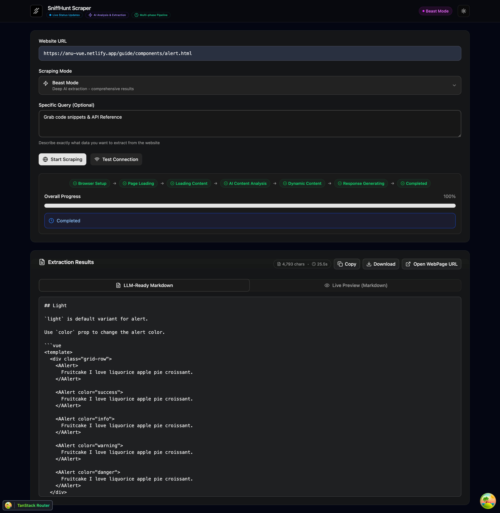

### 📝 Prerequisites

Before starting the web interface:

1. **Complete Setup**: Follow the [Quick Start Guide](/quick-start) for initial setup
2. **API Server Running**: The web interface requires the API server
3. **Environment Configured**: Ensure `.env` file is properly set up

### 🌐 Starting the Web Interface

##### From Root (Recommended)

```bash
# Step 1: Start the API server (Terminal 1)
bun run dev:server

# Step 2: Start the web interface (Terminal 2)
bun run dev:web
```

**Access Points:**

- 🌐 **Web Interface**: `http://localhost:6001`
- 🔌 **API Server**: `http://localhost:8080`

**Benefits:**

- Consistent workspace environment
- Automatic environment variable loading
- Coordinated development setup



##### Individual App Alternative

```bash
# Alternative: Start from web directory
cd apps/web
bun dev
```

**Note:** This method also loads the root `.env` file automatically.

##### Verify Setup

1. **API Server Health**: Visit `http://localhost:8080/health`
2. **Web Interface**: Open `http://localhost:6001` in your browser
3. **Test Scraping**: Try scraping `https://example.com` with normal mode

### 📱 Usage Guide

#### Basic Scraping Workflow

##### Step 1: Enter Target URL

Type or paste the website URL you want to scrape (for example):

- `https://anu-vue.netlify.app/guide/components/alert.html`

##### Step 2: Select Scraping Mode

**Normal Mode** - For standard websites

**Beast Mode** - For complex applications

##### Step 3: Add Semantic Query (Optional)

Use natural language to specify what content you want (for example):

- "Grab code snippets & API Reference"

##### Step 4: Start Scraping

Click the **"Extract Content"** button and watch real-time progress:

1. 🔗 **Connecting** - Establishing connection to target site
2. ⏳ **Loading** - Page loading and rendering
3. 🧠 **Analyzing** - AI-powered content understanding (Beast mode)
4. ⚡ **Extracting** - Converting to markdown format
5. ✅ **Complete** - Content ready for use
